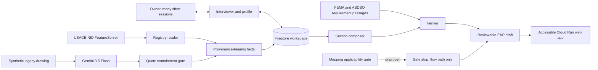

# Downstream

Downstream is a multi-session Collaborative Partner that helps a dam owner assemble a reviewable
Emergency Action Plan draft. It resolves public and document facts first, asks one owner question
at a time, learns from feedback, and keeps every claim inside an explicit evidence and authority
boundary.

Live URL: https://downstream-109051079423.us-central1.run.app

Repository: https://github.com/usv240/downstream

Judge path: open the product, select **Start clean preset**, answer the first question with **I do
not know what that means**, inspect the changed reading profile and context meter, then run
`/downstream/proof`.

## What it proves

- Real Gemini 3.5 Flash multimodal extraction from a synthetic 1958-style drawing, recorded and
  graded 5/5 against adjacent truth.
- A durable Firestore workspace that preserves facts, sessions, preferences, progress, and draft
  sections across visits.
- One question at a time, with no repeats and a visible reason for each question.
- Feedback that changes later behavior: reading level, vocabulary, and detail preference are stored
  separately from domain facts and remain inspectable.
- Bounded context: deduplicated facts, one active section, and fixed-k requirements remain within a
  670-token application budget as empty sessions accumulate.
- A fail-closed mapping gate. The demo renders a single flow-path input, never an inundation extent,
  depth, velocity, arrival time, or evacuation zone.
- Quote containment for regulatory claims. Empty or absent quotes cannot support a rendered claim.

## Architecture



The Mermaid source is also in `docs/architecture.mmd`, with a rendered
`docs/architecture.svg` for environments that do not render Mermaid.

## Research and claim boundaries

On August 11, 2026, direct count queries against the official USACE NID public FeatureServer
returned 92,606 total records and 16,972 records with `HAZARD_POTENTIAL='High'`. High hazard is a
consequence classification. It is not a condition assessment or a prediction that a dam will fail.

The public `EAP_PREPARED` field is null for many records. Downstream calls that value **unreported
in the selected public field**. It never converts null into a claim that a plan does not exist.

Primary sources:

- [USACE National Inventory of Dams](https://nid.sec.usace.army.mil/nid/): public inventory,
  fields, Web GIS service, and live query.
- [FEMA P-64, Emergency Action Planning for Dams](https://www.fema.gov/sites/default/files/2020-08/fema_dam-safety_emergency-action-planning_P-64.pdf):
  purpose, participants, plan elements, and review context.
- [ASDSO Emergency Action Planning](https://damsafety.org/dam-owners/emergency-action-planning):
  owner and emergency-manager collaboration, notification flow, and simplified mapping limits.
- [Simplified Inundation Maps for Emergency Action Plans](https://www.damsafety.org/sites/default/files/files/EAPWG%20Final%20SIMS.pdf):
  applicability limits and the need for engineering and regulatory judgment.

Full claim-by-claim notes are in `docs/research-traceability.md`.

## Run locally

Requirements: Python 3.12 or newer.

```bash
cd app
python -m venv .venv
source .venv/bin/activate
pip install -r requirements.txt
uvicorn service.main:app --reload --port 8080
```

On Windows PowerShell, activate with `.venv\Scripts\Activate.ps1`.

The local default is credential-free memory storage. To exercise durable Firestore persistence,
set `GOOGLE_CLOUD_PROJECT` and `USE_FIRESTORE=true`, then use Application Default Credentials.

## Verify

```bash
cd app
python -m pytest -q
python scripts/check_a11y.py
python scripts/downstream_demo_flow.py --url http://127.0.0.1:8080
```

Current verified result: 166 tests, accessibility green in both themes, and 19/19 demo checks.

To regenerate the multimodal evidence, first build the synthetic fixture and then make one paid
Vertex AI call:

```bash
cd app
python scripts/make_drawing_fixture.py
python -m scripts.record_drawing
```

The response is saved beside its truth and accuracy report under `app/fixtures/`.

## Deploy

```bash
cd app
export GOOGLE_CLOUD_PROJECT=your-project-id
bash deploy.sh
```

The deployment script creates a separate `downstream` Cloud Run service, permits public judge
access, and enables Firestore persistence. It does not share a URL or deployment with Day Three or
Sixty Days.

## Safety and provenance

The demo dam, drawing, contacts, and owner answers are synthetic. No agency seal is used. The
application is not affiliated with or endorsed by USACE, FEMA, ASDSO, or any state agency.

Every export remains a draft for owner, emergency manager, state dam-safety, and qualified
engineering review. Nothing is certified, approved, submitted, or represented as engineering
analysis.

AI assistance was used during design and implementation. Public sources and recorded model output
are disclosed so judges can distinguish measured behavior from design intent.
