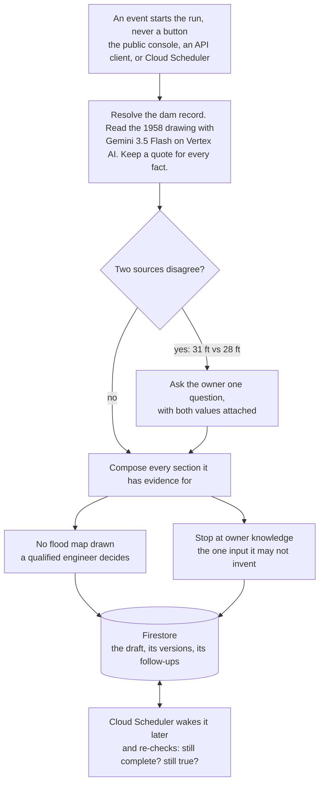

# Downstream

**An agent that drafts a dam's emergency action plan with the owner, not for them.**
It handles everything it can prove from the records, asks the owner only for what only they can
know, and refuses to draw a flood map it cannot justify.

| | |
|---|---|
| **Try it** | <https://downstream-109051079423.us-central1.run.app> (no key, no account) |
| **Demo video** | <https://youtu.be/15ALVczzqFE> |
| **Track** | The Collaborative Partner |

---

## Try it in thirty seconds

Open the live URL and press **Run the whole thing in one request**.

One request, and the agent resolves the dam record, reads a 1958 drawing with Gemini, keeps a
quote for every fact, notices that the drawing and the registry disagree about the dam's height,
drafts every section it has evidence for, refuses to produce a flood map, schedules its own
follow-ups, and stops at the questions only the owner can answer.

**Typical result: 15 steps it took on its own, 7 facts only the owner could give, 0 clicks needed
to keep it going.** Those counts are read back out of the run's stored timeline, not asserted.

Then press **Set a real-clock reminder** and wait about a minute. Cloud Scheduler wakes the
service, the agent re-checks the draft on its own, and the page shows which Cloud Run revision did
it. Close the tab and it still happens.

## What it does



Four things follow from that shape.

**It shows its work.** Every step is recorded with the actor that performed it, agent or person,
and the autonomy receipt is counted from that record rather than described.

**It learns from corrections.** When the owner fixes an answer the draft rewrites itself and the
previous version is kept, with the reason it changed. Nothing is silently overwritten.

**It works when nobody is watching.** Follow-ups are durable rows in Firestore, not timers in a
browser tab. Wakes claim once by compare-and-swap, retry a bounded number of times, and
dead-letter rather than looping.

**It is a service, not just a screen.** A self-serve API key takes about a second, with no account
and no invitation, and drives the same live agent from another application. See
[`docs/api-beta.md`](docs/api-beta.md).

## The part that matters most

The single most useful thing this tool could produce is a flood map showing which houses go under.
It will not produce one.

Simplified inundation mapping has documented conditions: the published method has to be
applicable, the jurisdiction has to accept it, and the result has to be checked against a
reference map. None of those are established here, so the gate fails closed and the draft says
plainly what it did not generate and who needs to do it instead.

It would have been easy to generate a plausible-looking polygon. An agent that knows the edge of
its own competence is worth more than one that guesses well.

## Built on Google Cloud

| Service | What it does here |
|---|---|
| **Cloud Run** | Hosts the agent. FastAPI, Python 3.12, `us-central1` |
| **Vertex AI** | Gemini 3.5 Flash reads the drawing, live in the request path |
| **Vertex AI** | Gemma 4 reviews name spans before text reaches a model (replayed from a graded recording) |
| **Firestore** | Workspaces, the durable wake ladder, key digests, quota counters |
| **Cloud Scheduler** | Wakes the service so follow-ups fire with nobody present |
| **Secret Manager** | The scheduler token, key digests, and the quota pepper |
| **Cloud Trace** | OpenTelemetry spans for every run |

`/stack` reports this list from the running process, so it can only claim a service this
deployment actually has wired.


The diagram is generated rather than drawn: [`docs/architecture.py`](docs/architecture.py) places
every box by hand and emits the SVG.

## Verify the claims

Nothing here needs credentials.

```bash
BASE=https://downstream-109051079423.us-central1.run.app

# What this deployment actually has wired
curl -s $BASE/stack

# Is Gemini live right now, or falling back to the recording?
curl -s $BASE/health          # model_execution: live_with_replay_fallback

# 18 executable safety and evidence checks
curl -s $BASE/downstream/proof
```

Against the deployed service on 27 August 2026: **63/63** end-to-end flow checks, **18/18** proof
checks, **371** automated tests. Reproduce them with:

```bash
cd app && pip install -r requirements-dev.txt
python -m pytest -q
python scripts/downstream_demo_flow.py --url $BASE
```

Every measured number, with the command that produced it, is in
[`VALIDATION_EVIDENCE.md`](VALIDATION_EVIDENCE.md).

## Boundaries

**The demo data is synthetic on purpose.** The dam in the public console is a synthetic record and
the 1958 drawing is a synthetic period-style drawing. That keeps the workflow fully testable
without making claims about a real owner's compliance. The federal inventory query is live and
real, and the API opens workspaces from actual NID identifiers.

**This produces a draft, nothing more.** No inundation extent, no depth, velocity, arrival time or
evacuation zone. No certification, approval, condition assessment, failure prediction, agency
contact, or submission. There is no endpoint that does any of those, and
[the executable proof](https://downstream-109051079423.us-central1.run.app/downstream/proof)
asserts it on every deploy.

**High hazard is a consequence classification.** It says what would happen if a dam failed. It is
not a condition assessment and not a prediction that any dam will fail.

**A null field is not an absent plan.** The public `EAP_PREPARED` field is null for many records.
Downstream calls that *unreported in the selected public field* and never converts it into a claim
that no plan exists.

## Sources

On 11 August 2026, direct count queries against the official USACE NID public FeatureServer
returned **92,606** total records and **16,972** with `HAZARD_POTENTIAL='High'`.

- [USACE National Inventory of Dams](https://nid.sec.usace.army.mil/nid/): the public inventory,
  its fields, and the live query.
- [FEMA P-64, Emergency Action Planning for Dams](https://www.fema.gov/sites/default/files/2020-08/fema_dam-safety_emergency-action-planning_P-64.pdf):
  what an emergency action plan is for, and what belongs in one.
- [ASDSO Emergency Action Planning](https://damsafety.org/dam-owners/emergency-action-planning):
  the notification chain and the owner's role in building it.
- [Simplified Inundation Maps for Emergency Action Plans](https://www.damsafety.org/sites/default/files/files/EAPWG%20Final%20SIMS.pdf):
  when simplified mapping may be applied, and the judgment it cannot replace.

Federal guidance does not replace state requirements, and the draft says so. Claim-by-claim notes
are in [`docs/research-traceability.md`](docs/research-traceability.md).

## Run it locally

Python 3.12 or newer.

```bash
cd app
python -m venv .venv && source .venv/bin/activate   # Windows: .venv\Scripts\Activate.ps1
pip install -r requirements.txt
uvicorn service.main:app --reload --port 8080
```

The local default is credential-free memory storage, so it runs with no Google Cloud project at
all. To exercise durable Firestore persistence, set `GOOGLE_CLOUD_PROJECT` and `USE_FIRESTORE=true`
and use Application Default Credentials.

## More

- [`docs/api-beta.md`](docs/api-beta.md): the API, key issuance, expiry and rotation
- [`docs/gallery`](docs/gallery): screenshots captured against the deployed service
- [`docs/research-traceability.md`](docs/research-traceability.md): every public claim and its source
- [`VALIDATION_EVIDENCE.md`](VALIDATION_EVIDENCE.md): every measured number and how to reproduce it

MIT licensed.
