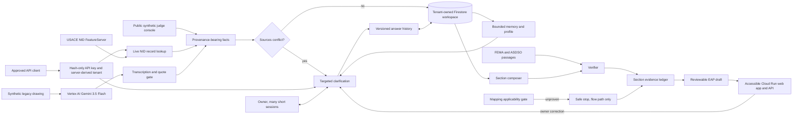

# Downstream

Downstream is a multi-session Collaborative Partner that helps a dam owner assemble a reviewable
Emergency Action Plan draft. It resolves public and document facts first, asks one owner question
at a time, learns from feedback, and keeps every claim inside an explicit evidence and authority
boundary.

Live URL: https://downstream-109051079423.us-central1.run.app

Repository: https://github.com/usv240/downstream

Judge path: open /?guided=1#workspace. Ask for simpler language once, use the synthetic example
answers, hold and reopen one question, then watch the 28 versus 31 foot source conflict become a
targeted sixth question. Save the prepared correction, inspect both answer versions, refresh the
shareable workspace URL to prove persistence, then open /evidence for the human-readable safety,
category, Gemini, and Gemma evidence dashboard.

## What it proves

- Real Gemini 3.5 Flash multimodal extraction from a synthetic 1958-style drawing, recorded and
  graded 5/5 against adjacent truth.
- Gemma 4 MaaS reviews synthetic owner notes for remaining name spans, recorded at 4/4 recall,
  0 false positives, and 0 identifiers surviving the replay gate.
- A durable Firestore workspace with a shareable resume URL that preserves facts, held questions,
  sessions, preferences, revisions, progress, and draft sections across refreshes.
- One question at a time, with no repeats and a visible reason for each question.
- Retrieved facts that disagree create a targeted clarification with both source values attached.
  An owner response adds context but cannot falsely resolve the engineering conflict.
- Feedback changes the work product. An owner correction creates a numbered immutable history,
  updates the affected plan section, and remains visible through a public audit route.
- Every rendered section publishes an evidence class: owner answer, published requirement, or
  fail-closed safety policy.
- Bounded context: deduplicated facts, one active section, and fixed-k requirements remain within a
  670-token application budget as empty sessions accumulate.
- A fail-closed mapping gate. The demo renders a single flow-path input, never an inundation extent,
  depth, velocity, arrival time, or evacuation zone.
- Quote containment for regulatory claims. Empty or absent quotes cannot support a rendered claim.

## Architecture



The Mermaid source is also in `docs/architecture.mmd`, with a rendered
`docs/architecture.svg` for environments that do not render Mermaid.

## Research and claim boundaries

On August 11, 2026, direct count queries against the official USACE NID public FeatureServer
returned 92,606 total records and 16,972 records with `HAZARD_POTENTIAL='High'`. High hazard is a
consequence classification. It is not a condition assessment or a prediction that a dam will fail.

The public `EAP_PREPARED` field is null for many records. Downstream calls that value **unreported
in the selected public field**. It never converts null into a claim that a plan does not exist.

Primary sources:

- [USACE National Inventory of Dams](https://nid.sec.usace.army.mil/nid/): public inventory,
  fields, Web GIS service, and live query.
- [FEMA P-64, Emergency Action Planning for Dams](https://www.fema.gov/sites/default/files/2020-08/fema_dam-safety_emergency-action-planning_P-64.pdf):
  purpose, participants, plan elements, and review context.
- [ASDSO Emergency Action Planning](https://damsafety.org/dam-owners/emergency-action-planning):
  owner and emergency-manager collaboration, notification flow, and simplified mapping limits.
- [Simplified Inundation Maps for Emergency Action Plans](https://www.damsafety.org/sites/default/files/files/EAPWG%20Final%20SIMS.pdf):
  applicability limits and the need for engineering and regulatory judgment.

Full claim-by-claim notes are in `docs/research-traceability.md`.

## Use it through the API

The judge preset stays public and synthetic. The protected `/v1` API opens a private workspace
from a live USACE National Inventory of Dams identifier, then supports the same answer, revise,
hold, feedback, and resume loop. The server derives the tenant from `X-API-Key`; workspace IDs
from another key return 404 even if guessed.

Full provisioning, expiry, and rotation instructions are in [the beta API guide](docs/api-beta.md).

Invited developers can open [the live Developer page](https://downstream-109051079423.us-central1.run.app/developer), enter the invitation
code supplied by the project owner, and generate a tenant-scoped key that expires after seven days.
The plaintext key is shown once and remains only in page memory. The page includes a connection
test, a copyable project request, immediate revocation, and a link to the interactive OpenAPI schema.

Operators can also create a non-expiring key through Secret Manager:

```bash
cd app
python scripts/create_beta_key.py --tenant owner_one --label "Owner one"
```

Store the printed hash-only JSON as the `BETA_API_KEY_HASHES` Secret Manager value and expose it
to Cloud Run. The plaintext key is shown once and must not be committed or embedded in frontend
JavaScript.

```bash
curl -H "X-API-Key: $DOWNSTREAM_API_KEY" \
  https://downstream-109051079423.us-central1.run.app/v1

curl -X POST \
  -H "X-API-Key: $DOWNSTREAM_API_KEY" \
  -H "Content-Type: application/json" \
  -d '{"nid_id":"IA00001"}' \
  https://downstream-109051079423.us-central1.run.app/v1/workspaces
```

Open `/docs`, select **Authorize**, and enter the key to explore every protected operation.
The API starts from an authoritative public inventory row rather than caller-supplied dam facts.
It still produces a reviewable draft only. It does not create an inundation extent, certify a plan,
make a condition assessment, predict failure, contact an agency, or submit anything.

## Run locally

Requirements: Python 3.12 or newer.

```bash
cd app
python -m venv .venv
source .venv/bin/activate
pip install -r requirements.txt
uvicorn service.main:app --reload --port 8080
```

On Windows PowerShell, activate with `.venv\Scripts\Activate.ps1`.

The local default is credential-free memory storage. To exercise durable Firestore persistence,
set `GOOGLE_CLOUD_PROJECT` and `USE_FIRESTORE=true`, then use Application Default Credentials.

## Verify

```bash
cd app
python -m pytest -q
python scripts/check_a11y.py
python scripts/downstream_demo_flow.py --url http://127.0.0.1:8080
```

Current verified result: 208 tests, accessibility green in both themes, and 26/26 demo checks.

To regenerate the multimodal evidence, first build the synthetic fixture and then make one paid
Vertex AI call:

```bash
cd app
python scripts/make_drawing_fixture.py
python -m scripts.record_drawing
```

The response is saved beside its truth and accuracy report under `app/fixtures/`.

## Deploy

```bash
cd app
export GOOGLE_CLOUD_PROJECT=your-project-id
bash deploy.sh
```

The deployment script creates a separate `downstream` Cloud Run service, permits public judge
access, and enables Firestore persistence. It does not share a URL or deployment with Day Three or
Sixty Days.

## Safety and provenance

The demo dam, drawing, contacts, and owner answers are synthetic. No agency seal is used. The
application is not affiliated with or endorsed by USACE, FEMA, ASDSO, or any state agency.

Every export remains a draft for owner, emergency manager, state dam-safety, and qualified
engineering review. Nothing is certified, approved, submitted, or represented as engineering
analysis.

AI assistance was used during design and implementation. Public sources and recorded model output
are disclosed so judges can distinguish measured behavior from design intent.
