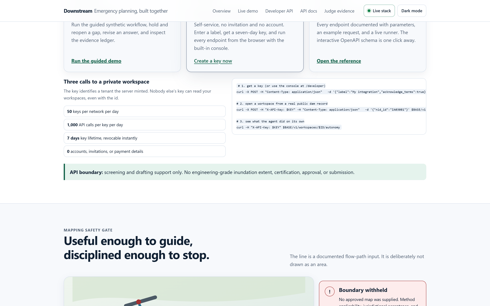
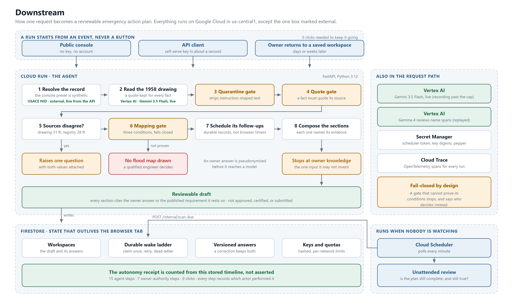

# Downstream

Downstream is a multi-session Collaborative Partner that helps a dam owner assemble a reviewable
Emergency Action Plan draft. It resolves public and document facts first, asks one owner question
at a time, learns from feedback, and keeps every claim inside an explicit evidence and authority
boundary.

Live URL: https://downstream-109051079423.us-central1.run.app

Repository: https://github.com/usv240/downstream

**Fastest judge path — one request, nothing to click.** `POST /downstream/demo/run`, or press
**Run the whole thing in one request** on the home page. The agent opens a run, reads the drawing,
grounds the facts, derives the 28-versus-31-foot conflict, composes every section that has
evidence, applies the mapping gate, schedules two durable wakes, fires them, and returns the draft
with a receipt. Typical result: **15 automatic agent steps, 0 continue clicks**.

**Full manual path.** Open `/?guided=1#workspace`. Ask for simpler language once, use the
synthetic example answers, hold and reopen one question, then watch the source conflict become a
targeted sixth question. Save the prepared correction, inspect both answer versions, refresh the
shareable workspace URL to prove persistence, then open `/evidence` for the safety, category,
Gemini, and Gemma dashboard. `/stack` reports which Google Cloud services this deployment is
actually using.

## What it proves

- **The opening sequence is autonomous.** One trigger, and the agent resolves the record, reads
  the drawing, grounds the facts, derives any source conflict, composes every section that has
  evidence, applies the mapping gate and registers its follow-ups. It stops at the owner
  questions, because owner knowledge is the one thing it is not allowed to invent. Every step is
  recorded on an ordered timeline with the actor that performed it, and the autonomy receipt at
  `/downstream/workspaces/{id}/autonomy` is counted from that timeline rather than described.
- **Work happens while nobody is watching.** A durable wake ladder registered at open reopens
  questions the owner held for later and records a follow-up on an incomplete draft. Cloud
  Scheduler calls `/internal/scan-due`; wakes claim once by compare-and-swap, retry a bounded
  number of times, and dead-letter rather than looping.
- **Live Gemini 3.5 Flash multimodal extraction, in the request path.** Opening a workspace on the
  deployed service makes a real Vertex AI call against a synthetic 1958-style drawing, and the
  facts it returns carry `live_gemini_3_5_flash` provenance. The same call was recorded once and
  graded 5/5 against adjacent truth; that recording is the fallback past the daily cap or on any
  Vertex error. `/health` and `/stack` report which of the two actually happened.
- Gemma 4 MaaS reviews synthetic owner notes for remaining name spans, recorded at 4/4 recall,
  0 false positives, and 0 identifiers surviving the replay gate.
- A durable Firestore workspace with a shareable resume URL that preserves facts, held questions,
  sessions, preferences, revisions, progress, and draft sections across refreshes.
- One question at a time, with no repeats and a visible reason for each question.
- Retrieved facts that disagree create a targeted clarification with both source values attached.
  An owner response adds context but cannot falsely resolve the engineering conflict.
- Feedback changes the work product. An owner correction creates a numbered immutable history,
  updates the affected plan section, and remains visible through a public audit route.
- Every rendered section publishes an evidence class: owner answer, published requirement, or
  fail-closed safety policy.
- Bounded context, **measured rather than asserted**: the meter estimates the assembled turn
  payload against what naive transcript replay would have sent. Structured context stays flat at
  496 tokens across twelve further empty sessions while replay grows from 945 to 1,415. The
  budget is 900 tokens and `/downstream/proof` includes a check that the meter can report a
  breach, so it is capable of failing.
- **Identifiers do not cross the model boundary.** The partner asks for an emergency manager's
  name and after-hours number, because a notification flowchart is useless without them. The
  owner keeps the verbatim answer; the pseudonymised form is what any model sees.
- **Text lifted off a scan cannot issue instructions.** The transcription goes through an
  untrusted-document gate before the quote gate, so an instruction-shaped line in a drawing is
  quarantined and can never ground a fact.
- **Abuse ceilings on every public write.** Per-network daily limits on workspace creation,
  key creation and workspace creation, and a per-key daily limit on the API, all enforced
  through atomic Firestore transactions. The stored bucket key is an HMAC of the address, never
  a raw IP, and only the proxy-controlled tail of `X-Forwarded-For` is trusted.
- A fail-closed mapping gate. The demo renders a single flow-path input, never an inundation extent,
  depth, velocity, arrival time, or evacuation zone.
- Quote containment for regulatory claims. Empty or absent quotes cannot support a rendered claim.

## What it looks like



*One request. The agent resolved the record, read the drawing with Gemini, grounded every fact in a
quote, derived the conflict between two sources, composed the draft, applied the mapping gate and
scheduled its own follow-ups. The counts are read back out of the stored timeline, not asserted.*

More in [`docs/gallery`](docs/gallery): the landing page, the ordered run timeline, the judge
evidence page, and the developer console.

## Architecture

See [`docs/architecture.mmd`](docs/architecture.mmd) for the source and
[`docs/architecture.svg`](docs/architecture.svg) for a rendered copy.



## Research and claim boundaries

On August 11, 2026, direct count queries against the official USACE NID public FeatureServer
returned 92,606 total records and 16,972 records with `HAZARD_POTENTIAL='High'`. High hazard is a
consequence classification. It is not a condition assessment or a prediction that a dam will fail.

The public `EAP_PREPARED` field is null for many records. Downstream calls that value **unreported
in the selected public field**. It never converts null into a claim that a plan does not exist.

Primary sources:

- [USACE National Inventory of Dams](https://nid.sec.usace.army.mil/nid/): public inventory,
  fields, Web GIS service, and live query.
- [FEMA P-64, Emergency Action Planning for Dams](https://www.fema.gov/sites/default/files/2020-08/fema_dam-safety_emergency-action-planning_P-64.pdf):
  purpose, participants, plan elements, and review context.
- [ASDSO Emergency Action Planning](https://damsafety.org/dam-owners/emergency-action-planning):
  owner and emergency-manager collaboration, notification flow, and simplified mapping limits.
- [Simplified Inundation Maps for Emergency Action Plans](https://www.damsafety.org/sites/default/files/files/EAPWG%20Final%20SIMS.pdf):
  applicability limits and the need for engineering and regulatory judgment.

Full claim-by-claim notes are in `docs/research-traceability.md`.

## Use it through the API

The judge preset stays public and synthetic. The protected `/v1` API opens a private workspace
from a live USACE National Inventory of Dams identifier, then supports the same answer, revise,
hold, feedback, and resume loop. The server derives the tenant from `X-API-Key`; workspace IDs
from another key return 404 even if guessed.

Full provisioning, expiry, and rotation instructions are in [the beta API guide](docs/api-beta.md).

**Anyone can get a key in about thirty seconds.** Open
[the Developer page](https://downstream-109051079423.us-central1.run.app/developer), enter a label
(email and organisation are optional), and a seven-day tenant-scoped key is issued immediately. No
invitation, no account, no payment details.

The tenant is **minted by the server**, not chosen by the caller: two people who create keys
minutes apart land in different tenants and cannot reach each other's workspaces. The plaintext key
is returned once and lives only in page memory; only its SHA-256 digest is stored.

That page is also a working console. Pick any endpoint, edit the body, and execute it against the
live service. Every response is shown four ways: a readable summary, the raw JSON, the response
headers carrying your remaining budget, and the equivalent `curl` so anything you do there can be
reproduced in a terminal. **Run the whole sequence** performs all eight calls in order and reports
what each one proved. The full reference, with parameters and example bodies for every route, is on
the same page, and the interactive OpenAPI schema is at `/docs`.

Operators can also create a non-expiring key through Secret Manager:

```bash
cd app
python scripts/create_beta_key.py --tenant owner_one --label "Owner one"
```

Store the printed hash-only JSON as the `BETA_API_KEY_HASHES` Secret Manager value and expose it
to Cloud Run. The plaintext key is shown once and must not be committed or embedded in frontend
JavaScript.

```bash
BASE=https://downstream-109051079423.us-central1.run.app

# Who am I, and what are my limits?
curl -H "X-API-Key: $DOWNSTREAM_API_KEY" "$BASE/v1"

# Find a real identifier first. The inventory is live, so do not hardcode one.
curl -s "$BASE/downstream/nid/search?limit=3&state=IA"

# Open a private workspace from that public record.
curl -X POST \
  -H "X-API-Key: $DOWNSTREAM_API_KEY" \
  -H "Content-Type: application/json" \
  -d '{"nid_id":"IA03081"}' \
  "$BASE/v1/workspaces"

# Then answer, skip, revise, give feedback, resume, and read the autonomy receipt.
curl -X POST -H "X-API-Key: $DOWNSTREAM_API_KEY" -H "Content-Type: application/json" \
  -d '{"question_id":"access_heavy_rain","answer":"The low crossing washes out."}' \
  "$BASE/v1/workspaces/$WORKSPACE_ID/answer"

curl -H "X-API-Key: $DOWNSTREAM_API_KEY" "$BASE/v1/workspaces/$WORKSPACE_ID/autonomy"

# Revoke it when you are done. The key stops working immediately.
curl -X DELETE -H "X-API-Key: $DOWNSTREAM_API_KEY" "$BASE/v1/key"
```

Open `/docs`, select **Authorize**, and enter the key to explore every protected operation.
The API starts from an authoritative public inventory row rather than caller-supplied dam facts.
It still produces a reviewable draft only. It does not create an inundation extent, certify a plan,
make a condition assessment, predict failure, contact an agency, or submit anything.

## Run locally

Requirements: Python 3.12 or newer.

```bash
cd app
python -m venv .venv
source .venv/bin/activate
pip install -r requirements.txt
uvicorn service.main:app --reload --port 8080
```

On Windows PowerShell, activate with `.venv\Scripts\Activate.ps1`.

The local default is credential-free memory storage. To exercise durable Firestore persistence,
set `GOOGLE_CLOUD_PROJECT` and `USE_FIRESTORE=true`, then use Application Default Credentials.

## Verify

```bash
cd app
pip install -r requirements-dev.txt   # pytest, httpx and ruff; the service does not need them
python -m pytest -q
python -m ruff check .
python scripts/check_a11y.py
python scripts/downstream_demo_flow.py --url http://127.0.0.1:8080
```

The last one runs against a URL, so it works equally against the deployed service:

```bash
python scripts/downstream_demo_flow.py --url https://downstream-109051079423.us-central1.run.app
```

Current verified result: **371 tests**, accessibility green in both themes, and **63/63** demo
checks. Full evidence, including what is deliberately switched off in the deployed configuration,
is in [VALIDATION_EVIDENCE.md](VALIDATION_EVIDENCE.md).

To regenerate the multimodal evidence, first build the synthetic fixture and then make one paid
Vertex AI call:

```bash
cd app
python scripts/make_drawing_fixture.py
python -m scripts.record_drawing
```

The response is saved beside its truth and accuracy report under `app/fixtures/`.

## Deploy

```bash
cd app
export GOOGLE_CLOUD_PROJECT=your-project-id
bash deploy.sh
```

The deployment script creates the `downstream` Cloud Run service, permits public judge access, and
enables Firestore persistence. The repository owns its public URL and deployment configuration.

Two things are off unless you turn them on, and the script prints both reminders when it finishes:

- **Scheduled execution.** The durable wake ladder only fires when something calls it. Point a
  Cloud Scheduler cron at `POST /internal/scan-due` with the `X-Scheduler-Token` header. Without
  `INTERNAL_SCHEDULER_TOKEN` configured the route returns 503 rather than running unauthenticated.
- **Live inference.** Set `DOWNSTREAM_LIVE_MODEL=true` to put Gemini 3.5 Flash in the request
  path. It is capped by `QUOTA_LIVE_MODEL_CALLS_PER_DAY` (25 by default) and replays the graded
  recording past the cap or on any Vertex error. `/health` and `/stack` report which mode is
  running, so the page can never claim live inference that is not happening.

## Limits and quotas

| Ceiling | Default | Keyed to |
|---|---|---|
| Developer key creations | **50 / day** | caller network |
| Authenticated `/v1` calls | **1,000 / day** | API key |
| Public demonstration workspaces | **500 / day** | caller network |
| Live Gemini calls | 25 / day | deployment |

These are sized so that testing the API thoroughly never hits a wall. They exist to stop a runaway
script, not to ration honest use. Every authenticated response carries `X-RateLimit-Limit`,
`X-RateLimit-Remaining` and `X-RateLimit-Reset`, so you never have to guess what is left.

Counters are Firestore transactions, so two concurrent requests cannot both pass the last slot.
What is stored is an HMAC of the caller address under a server-held pepper, never a raw IP. Only
the proxy-controlled tail of `X-Forwarded-For` is trusted, so a caller cannot mint a fresh bucket
by prepending a header. `/stack` publishes the limits the service is enforcing.

## Safety and provenance

The demo dam, drawing, contacts, and owner answers are synthetic. No agency seal is used. The
application is not affiliated with or endorsed by USACE, FEMA, ASDSO, or any state agency.

Every export remains a draft for owner, emergency manager, state dam-safety, and qualified
engineering review. Nothing is certified, approved, submitted, or represented as engineering
analysis.

AI assistance was used during design and implementation. Public sources and recorded model output
are disclosed so judges can distinguish measured behavior from design intent.
